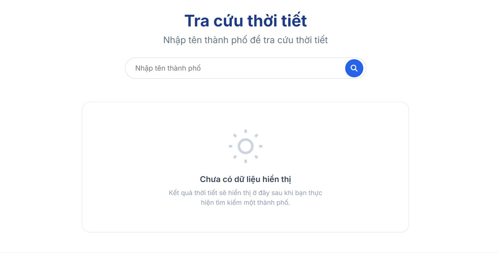
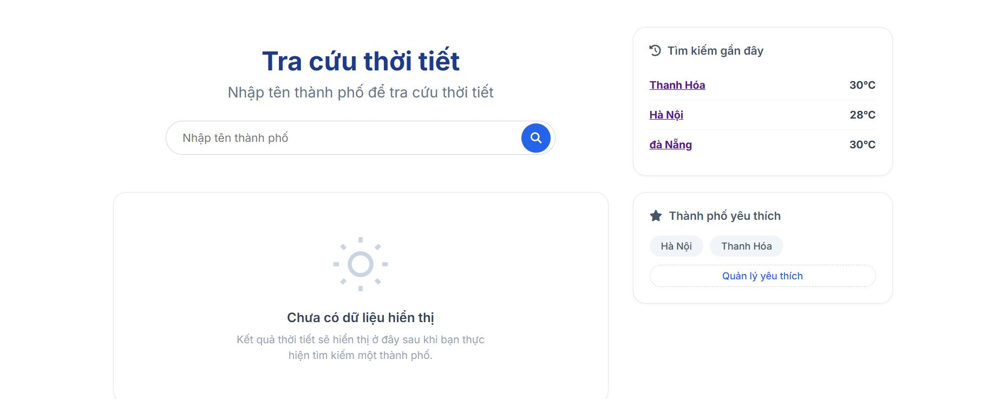
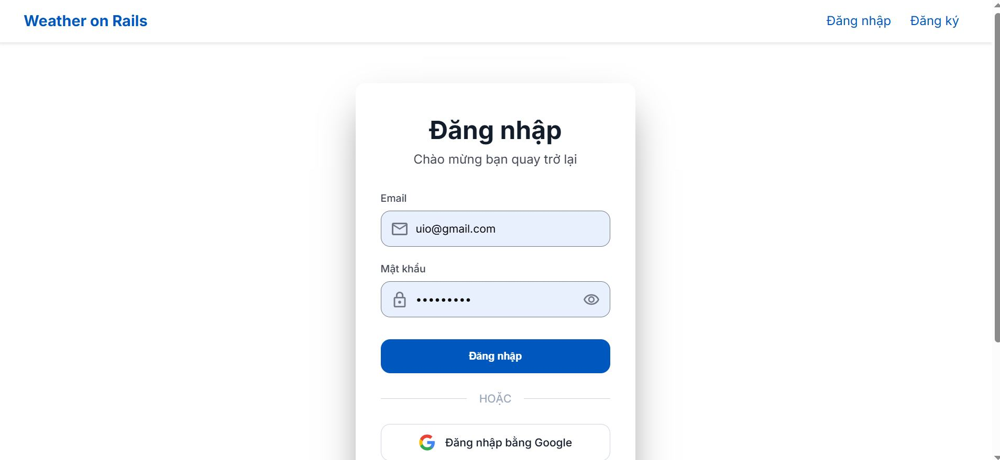
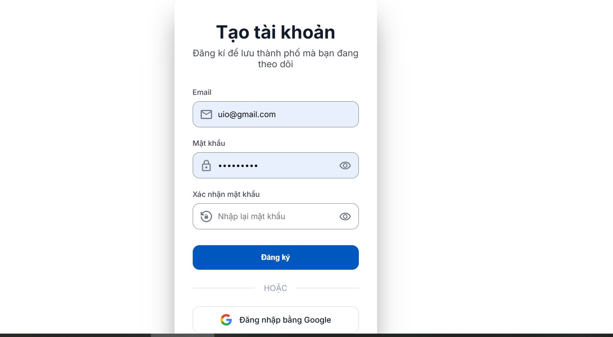
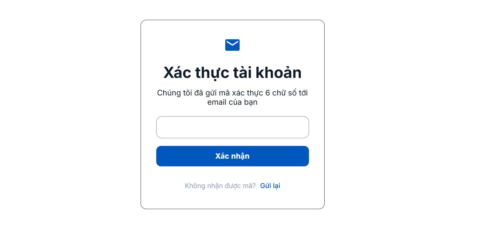
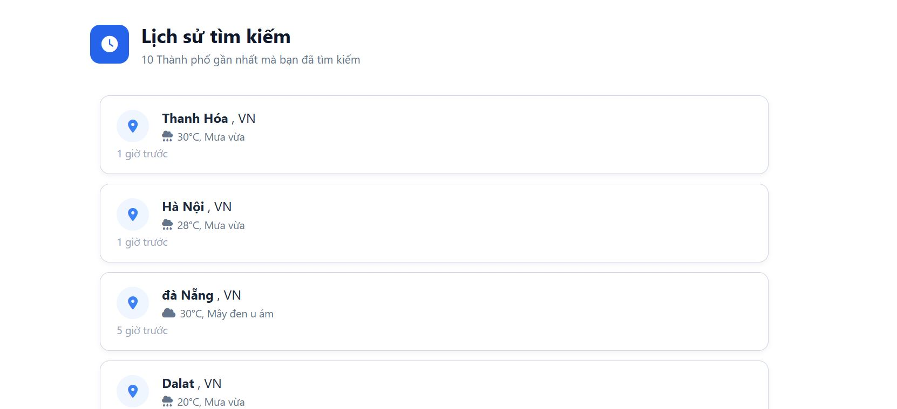

# Weather on Rails

**Weather on Rails** là ứng dụng web cho phép người dùng tra cứu thông tin thời tiết thời gian thực, quản lý các thành phố yêu thích và xem lại lịch sử tìm kiếm. Ứng dụng được xây dựng trên nền tảng **Ruby on Rails 6** kết hợp với **MySQL** và được container hóa bằng **Docker**.

---

## Các Tính Năng Chính

* **Xác thực người dùng (Authentication):**
  * Đăng ký tài khoản mới và xác minh qua mã **OTP**.
  * Đăng nhập / Đăng xuất an toàn.
  * Hỗ trợ đăng nhập nhanh bằng tài khoản **Google (OAuth)**.
* **Tra cứu thời tiết:** Tìm kiếm và xem thông tin thời tiết chi tiết theo thành phố.
* **Quản lý thành phố yêu thích (Favorites):** Lưu các thành phố thường xuyên theo dõi vào danh sách yêu thích để xem nhanh.
* **Lịch sử tìm kiếm (History):** Tự động lưu và cho phép xem lại danh sách các thành phố đã tra cứu trước đó.

## 📸 Giao diện minh họa

### 1. Trang chủ & Tra cứu thời tiết (Chưa đăng nhập)


### 2. Trang chủ & Tra cứu thời tiết (Đã đăng nhập)


### 3. Giao diện Đăng nhập


### 4. Giao diện Đăng ký


### 5. Giao diện Xác thực OTP


### 6. Danh sách thành phố yêu thích (Favorites)


### 7. Lịch sử tìm kiếm (History)


---

## Cấu hình Biến Môi Trường (.env)

Tạo file `.env` tại thư mục gốc của dự án và khai báo các biến môi trường cần thiết trước khi chạy:

```env
# Cấu hình gửi email xác thực OTP (Gmail SMTP)
GMAIL=your_email@gmail.com
GMAIL_PASSWORD=your_gmail_app_password

# Cấu hình Đăng nhập Google OAuth
GOOGLE_CLIENT_ID=your_google_client_id
GOOGLE_CLIENT_SECRET=your_google_client_secret

# API Key lấy dữ liệu thời tiết (OpenWeatherMap)
WEATHER_API=your_weather_api_key

# Mật khẩu Database MySQL trong Docker
MYSQL_ROOT_PASSWORD=password
```

---

## Công Nghệ Sử Dụng

* **Language:** Ruby 2.6.5
* **Framework:** Ruby on Rails 6.0.0
* **Database:** MySQL 5.7
* **Containerization:** Docker & Docker Compose
* **Frontend:** HTML5, CSS3, FontAwesome

---

# Các bước setup Docker và môi trường để chạy Ruby on Rails và MySQL:

- Tạo file Dockerfile và viết các lệnh để tải Ruby on Rails về trong máy ảo Linux của Docker (Do phiên bản 6.0.0 đã cũ nên phải thêm 2 lệnh ở dưới để tải bản lưu trữ về)
RUN echo "deb http://archive.debian.org/debian buster main" > /etc/apt/sources.list && \
    echo "Acquire::Check-Valid-Until \"false\";" > /etc/apt/apt.conf.d/10no--check-valid-until
- Tạo file docker-compose.yml để setup cho database nhằm giúp cho Docker khởi tạo 2 máy ảo chạy song song cùng lúc, 1 máy chạy môi trường Ruby on Rails và 1 máy chạy MySQL
- Tạo file Gemfile với mục đích khai báo các phiên bản trong Rails mà mình muốn tải về, ở đây là Rails 6.0.0
- Trong file Gemfile, thêm gem 'concurrent-ruby', '1.3.4' cùng gem 'ffi', '1.15.5' vào cuối cùng để sửa lỗi xung đột phiên bản của Rails 6.
- Tạo file Gemfile.lock rỗng để sau khi khởi tạo nó sẽ lưu các phiên bản và thư viện đã tải về trong đó
- Tạo file entrypoint.sh để tự động xóa các file pid khi Docker build fail
(Các file này đã có sẵn trong project, nên có thể bỏ qua bước này)

# Sau khi tạo và viết các lệnh, chạy lần lượt các câu lệnh sau để setup:
- `docker-compose build`
- `docker-compose run web rails db:create`
- `docker-compose run web rails db:migrate`
- `docker compose exec web rails db:migrate RAILS_ENV=test` - Tạo các bảng cho database test
- `docker-compose up`

# Lưu ý
- Nếu bị lỗi "exec /usr/bin/entrypoint.sh: no such file or directory" ở file entrypoint.sh thì bấm chuyển CRLF sang LF tại file đó, sau đó chạy lại lệnh docker-compose build, rồi chạy lại lệnh bị lỗi
- Hiện tại ở trong file docker-compose.yml đang fix mật khẩu là password, có thể thêm biến ENV ở trên vào trong file đó lại
---

 Sau khi setup xong, truy cập vào trang http://localhost:3000/login để xem kết quả.
